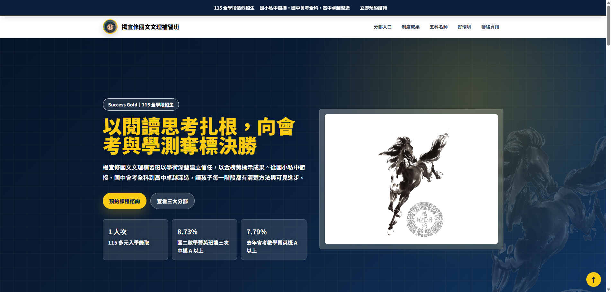

# 楊宜修國文文理補習班形象網站

Demo link: <https://chenyuhsu413.github.io/YYXTest/>



## Project Overview

This is a responsive one-page brand and recruitment website for 楊宜修國文文理補習班. The site focuses on 115 全學段招生, highlighting the brand's 三好特色：好師資、好規劃、好環境.

The content presents the school as a stable learning environment from elementary school through high school, supported by cross-stage planning, strong academic positioning, and a 台大級師資團隊.

## Key Sections

- Hero section with 115 全學段招生 message and conversion CTAs.
- Dynamic division tabs for 國小部、國中部、高中部.
- Teacher cards for 楊宜修、章子瑜、Victor、林詠鈞 / 許煬、大雄.
- Results and environment section featuring:
  - 115 年度多元入學榜單列名人次 11 人次
  - 114 會考名人榜 15 位
  - 國二數學菁英班中模 A 以上比例 94.44%
- Contact links for phone, LINE, and Google Maps.

## Technical Notes

- Built with HTML5, Tailwind CSS CDN, custom CSS, and vanilla JavaScript.
- Page styles are stored in `styles.css`.
- Interactive behavior and Tailwind configuration are stored in `script.js`.
- Current image assets are placeholder images with detailed `alt` descriptions for future replacement.
- Documentation is organized under `docs/`.

## Project Structure

```text
.
├── index.html
├── styles.css
├── script.js
├── README.md
├── docs/
│   ├── log.md
│   └── 工作報告.md
└── sources/
    └── image assets and source materials
```

## Contact Information

- Address: 崇德路二段196號2樓
- Phone: 04-2247-9111
- LINE: @996ajziy
- Google Map: linked from the contact section

## Deployment

This site is deployed with GitHub Pages from the `main` branch.
