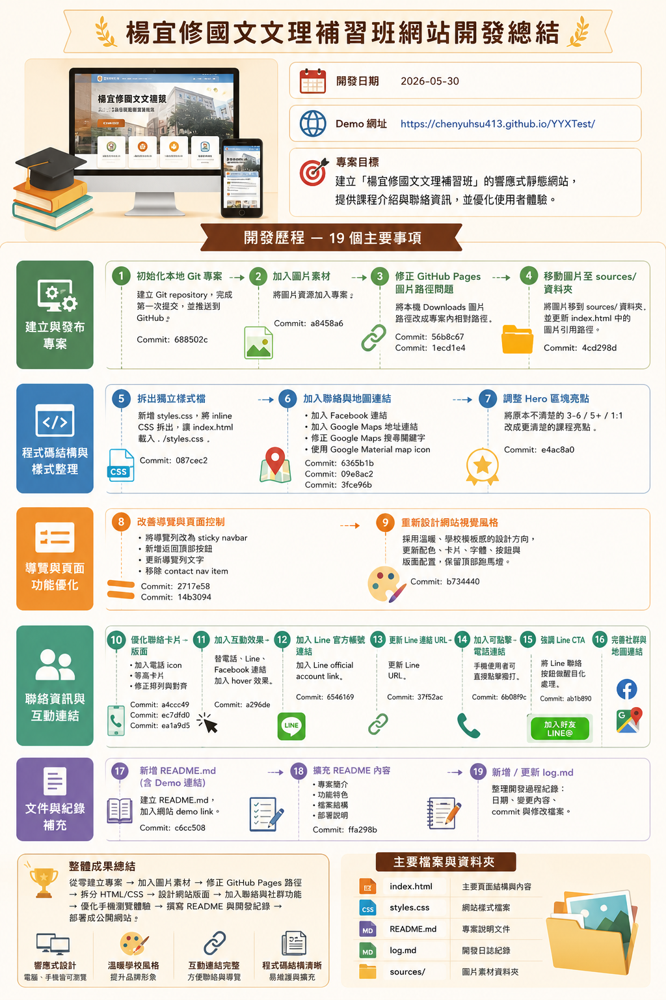

# 楊宜修國文文理補習班網站開發工作報告

日期：2026-05-30

Demo 網址：https://chenyuhsu413.github.io/YYXTest/



## 最新補充工作紀錄

原工作報告完成後，網站進一步改版為全寬招生頁型式，並將新取得的招生 DM、榜單、課程圖卡與 PDF 擷取素材整合進網站。

## 最新完成項目

- 改版首頁為「國三會考全科班」招生導向版面。
- 使用 PDF 擷取出的水墨馬圖作為主視覺素材。
- 新增全科班課程架構，整理國文、英文、數學、自然、社會五科時段。
- 新增成績亮點與 115 年度多元入學榜單區塊。
- 新增暑期與會考規劃、自然專班與課程圖卡展示區。
- 新增 `sources/image-info.md`，整理各圖片尺寸與內容重點。
- 匯入 DM PDF、PDF 擷取圖片、榜單圖、模考成績圖與課程宣傳圖。
- 裁切並加入 `math-honor-list-cropped.jpg`，讓數學榜單呈現更聚焦。
- 調整課堂側拍圖庫版面，讓照片排列更穩定。
- 移除重複的課堂照片，避免頁面內容冗餘。

## 最新相關檔案

```text
sources/
├── image-info.md
├── admission-results.jpg
├── math-honor-list-cropped.jpg
├── dm-cover.pdf
├── dm-inside.pdf
├── messageImage_*.jpg
└── pdf-extracted/
    ├── hero-horse.png
    ├── cover-full-page.png
    ├── inside-full-page.png
    ├── cover-main-image-layer.png
    ├── inside-main-image-layer.png
    └── pdf-extracted-contact-sheet.jpg
```

## 工作摘要

本次工作完成「楊宜修國文文理補習班」響應式靜態網站建置，包含頁面內容整理、視覺風格調整、圖片素材歸檔、聯絡資訊互動化，以及 GitHub Pages 部署。

## 主要完成項目

- 建立 Git 專案並推送至 GitHub。
- 上傳並整理網站圖片素材至 `sources/` 資料夾。
- 將 CSS 從 `index.html` 拆分至獨立 `styles.css`。
- 調整網站為溫暖校園風格版面。
- 保留頂部招生跑馬燈。
- 製作 sticky 導覽列與返回頂部按鈕。
- 新增電話、Line、Facebook 與 Google Maps 互動連結。
- 支援手機點擊電話直接撥號。
- 強化 Line 官方帳號 CTA 顯示。
- 新增 `README.md` 與 `log.md` 文件。

## 專案檔案

```text
.
├── index.html
├── styles.css
├── README.md
├── log.md
├── 工作報告.md
└── sources/
    ├── image assets
    └── work-report-summary.png
```

## 部署狀態

網站已透過 GitHub Pages 發布，可由 Demo 網址瀏覽最新版本。
